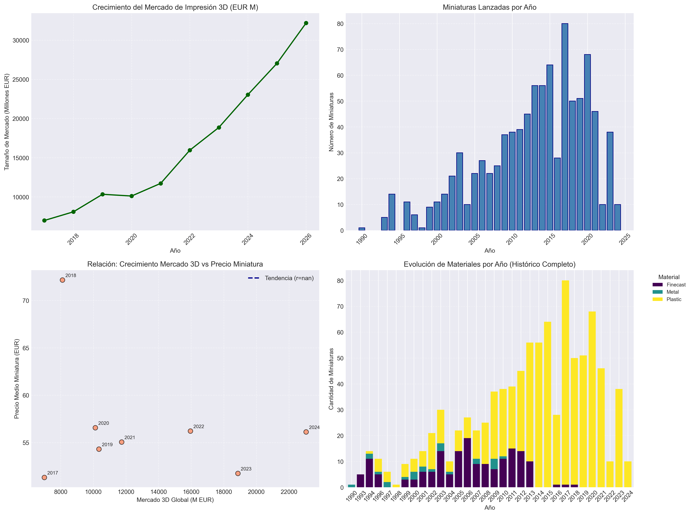
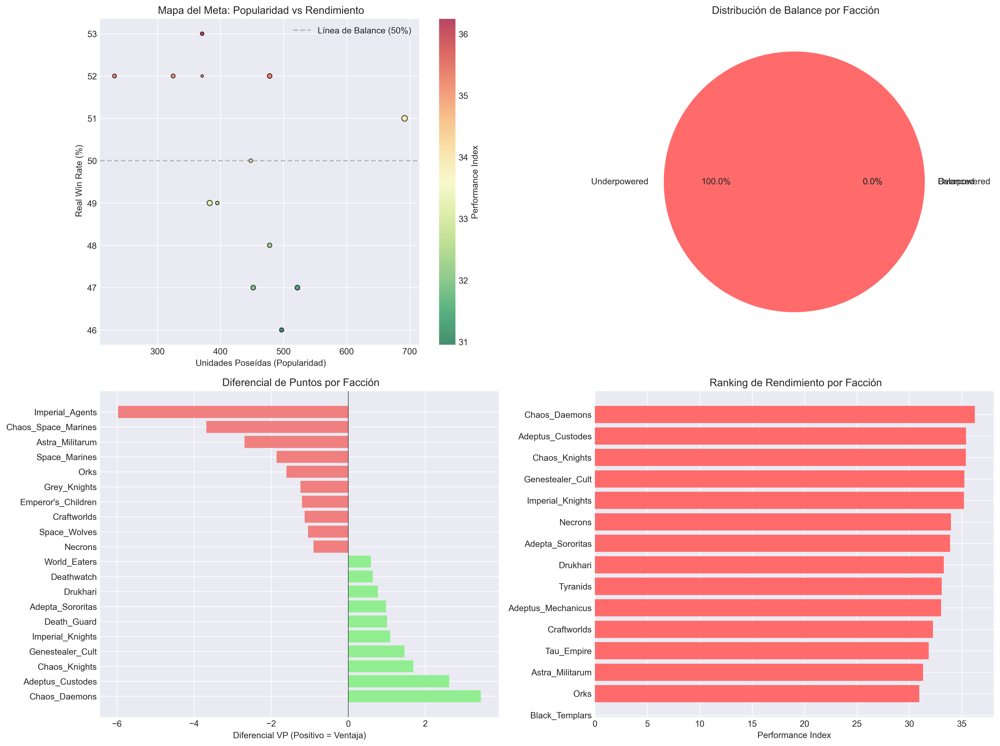
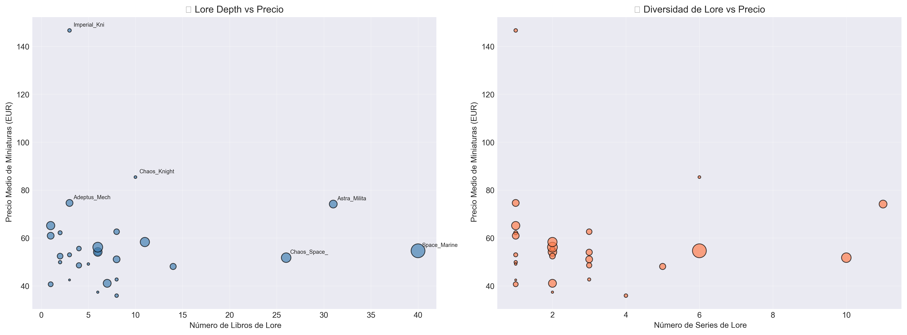
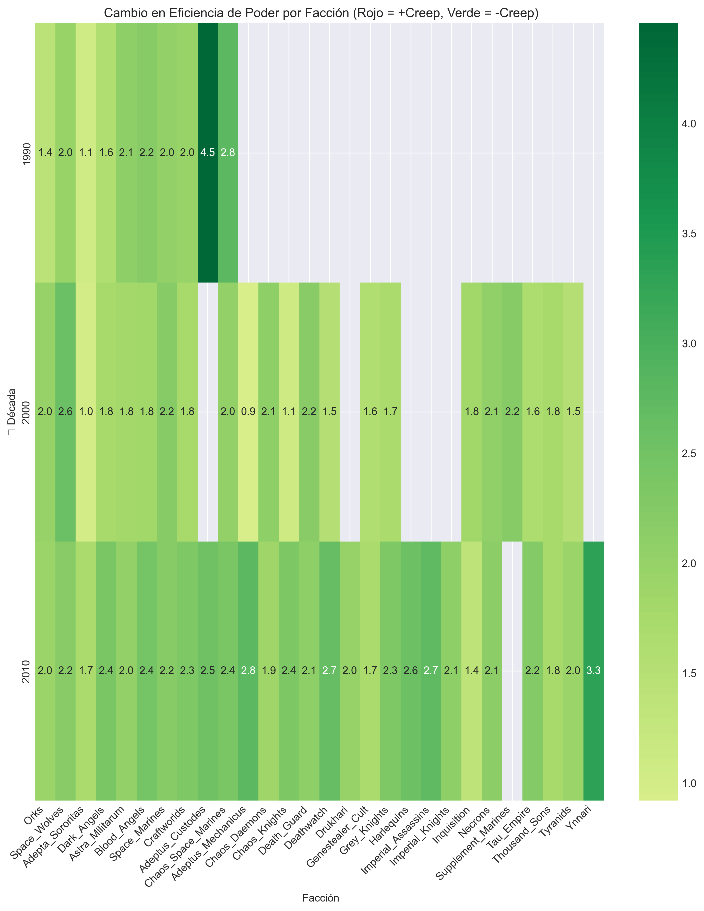

<h1 style="display: flex; align-items: center; gap: 15px;">
    
     Exploratory Data Analysis - Warhammer 40K
    
</h1>

Este repositorio contiene el análisis exploratorio de datos (EDA) realizado sobre diversos conjuntos de datos relacionados con el universo de Warhammer 40K. A continuación, se destacan las hipótesis más interesantes y sus resultados.

---

## Hipótesis Destacadas

### 2. Probabilidad de renovación de facción

- **Pregunta**: ¿Qué probabilidad hay de que tu facción favorita sea renovada?
- **Resultado**: Se identificaron las facciones con mayor y menor probabilidad de renovación basándose en un score heurístico.



---

### 5. Soporte de facciones

- **Pregunta**: ¿Qué facciones reciben más soporte?
- **Resultado**: Se analizaron métricas como cantidad de miniaturas, precio promedio, índice de soporte y win rate. Las facciones con mayor índice de soporte fueron Space Marines, Necrons y Orks.



---

### 7. Predicción de eventos del Lore

- **Pregunta**: ¿Se pueden predecir acontecimientos del Lore en base a las colecciones de figuras?
- **Resultado**: Solo Tau Empire mostró una correlación significativa entre libros de lore y miniaturas por facción y año.



---

### 8. [Título de la Hipótesis 8]

- **Pregunta**: [Pregunta de la Hipótesis 8]
- **Resultado**: [Resumen del resultado de la Hipótesis 8].



---

## Estructura del Repositorio

- **`src/img/`**: Contiene las imágenes utilizadas en el análisis.
- **`data/`**: Conjuntos de datos originales utilizados para el análisis.
- **`clear_data/`**: Conjuntos de datos procesados y listos para el análisis.
- **`notebooks/`**: Notebooks de Jupyter con el análisis detallado.
- **`docs/`**: Documentación del proyecto, incluyendo la memoria del análisis.

---

## Cómo Usar Este Repositorio

1. Clona este repositorio:
   ```bash
   git clone <URL>
   ```
2. Abre los notebooks en Jupyter para explorar el análisis.
3. Revisa la memoria para un resumen detallado de los resultados.

---

## Créditos

Este análisis fue realizado por [Tu Nombre].
